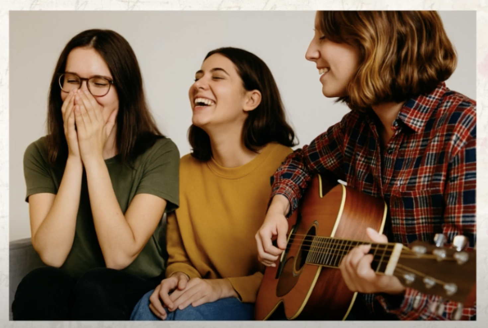

Описание картинки на греческом языке с переводом на русский.

Источник: [YouTube видео](https://www.youtube.com/watch?v=_qdhWXl8Ic0)

### **Вариант 1**

**Σε αυτή την εικόνα βλέπω τρεις νέες γυναίκες.**
_На этой картинке я вижу трёх молодых женщин._

**Είναι μέσα στο σπίτι.**
_Они находятся в помещении (дома)._ 

**Η μία γυναίκα κρατάει μια κιθάρα και παίζει.**
_Одна женщина держит гитару и играет._

**Οι άλλες δύο γυναίκες γελάνε και φαίνονται χαρούμενες.**
_Другие две женщины смеются и выглядят счастливыми._

**Η πρώτη γυναίκα έχει μακριά ίσια μαύρα μαλλιά.**
_У первой женщины длинные прямые чёрные волосы._

**Φοράει γυαλιά, μία μπλούζα και ίσως ένα μαύρο παντελόνι.**
_Она носит очки, блузку и, возможно, чёрные брюки._

**Η δεύτερη γυναίκα φοράει μία πορτοκαλί μπλούζα και ένα τζιν παντελόνι.**
_Вторая женщина носит оранжевую блузку и джинсы._

**Έχει μαύρα μαλλιά, μάλλον όχι πολύ μακριά, και γελάει πολύ.**
_У неё чёрные волосы, не слишком длинные, и она сильно смеётся._

**Η τρίτη γυναίκα παίζει κιθάρα.**
_Третья женщина играет на гитаре._

**Έχει κοντά καστανά μαλλιά και φοράει ένα πουκάμισο με κόκκινο, άσπρο και μπλε χρώμα.**
_У неё короткие каштановые волосы, и она носит рубашку с красным, белым и синим цветами._

**Όλες οι γυναίκες είναι χαρούμενες, γελάνε και φαίνεται ότι περνάνε καλά.**
_Все женщины счастливы, смеются и видно, что хорошо проводят время._

**Μάλλον τους αρέσει να είναι μαζί, να τραγουδάνε ή να ακούν μουσική.**
_Видимо, им нравится быть вместе, петь или слушать музыку._

---

### **Вариант 2**

**Βλέπω τρεις νέες γυναίκες σε ένα σπίτι.**
_Я вижу трёх молодых женщин в доме._

**Είναι μαζί, περνάνε καλά και γελάνε.**
_Они вместе, хорошо проводят время и смеются._

**Η πρώτη γυναίκα έχει μακριά, ίσια, μαύρα μαλλιά.**
_У первой женщины длинные, прямые, чёрные волосы._

**Φοράει γυαλιά και μία καλοκαιρινή μπλούζα σε χρώμα χακί.**
_Она носит очки и летнюю блузку цвета хаки._

**Φοράει και μαύρο παντελόνι. Γελάει και φαίνεται ότι απολαμβάνει τη στιγμή.**
_Также на ней чёрные брюки. Она смеётся и видно, что наслаждается моментом._

**Η δεύτερη γυναίκα φοράει μια πορτοκαλί μπλούζα και ανοιχτό μπλε τζιν.**
_Вторая женщина одета в оранжевую блузку и светло-голубые джинсы._

**Έχει μαύρα μαλλιά, όχι πολύ μακριά, και τα μάτια της είναι κλειστά από το γέλιο.**
_У неё чёрные волосы, не очень длинные, и глаза закрыты от смеха._

**Γελάει πολύ δυνατά.**
_Она громко смеётся._

**Η τρίτη γυναίκα έχει κοντά καστανά μαλλιά και φοράει ένα πολύχρωμο πουκάμισο.**
_У третьей короткие каштановые волосы, и она носит разноцветную рубашку._

**Το πουκάμισο έχει κόκκινο, άσπρο και μπλε σκούρο χρώμα.**
_В рубашке есть красный, белый и тёмно-синий цвета._

**Δεν είναι καλοκαιρινό, έχει μακριά μανίκια.**
_Это не летняя рубашка — у неё длинные рукава._

**Παίζει κιθάρα και χαμογελάει. Ίσως τραγουδάει κιόλας.**
_Она играет на гитаре и улыбается. Возможно, ещё и поёт._

**Όλες φαίνονται πολύ χαρούμενες.**
_Все выглядят очень счастливыми._

**Γελάνε με την καρδιά τους και περνάνε πολύ καλά.**
_Они смеются от души и отлично проводят время._

**Μάλλον τους αρέσει να είναι μαζί σαν παρέα, να τραγουδάνε ή να ακούν μουσική.**
_Видимо, им нравится быть вместе как компания, петь или слушать музыку._

---

### **Вариант GPT**

**Στην εικόνα βλέπουμε τρία κορίτσια.**
_На картинке мы видим трёх девушек._

**Είναι μέσα σε ένα δωμάτιο και κάθονται κοντά.**
_Они находятся в комнате и сидят рядом друг с другом._

**Τα κορίτσια φαίνονται πολύ χαρούμενα.**
_Девушки выглядят очень счастливыми._

**Το κορίτσι στα δεξιά φοράει ένα πουκάμισο με καρό σχέδιο και παίζει κιθάρα.**
_Девушка справа одета в рубашку в клетку и играет на гитаре._

**Το κορίτσι στη μέση φοράει μία κίτρινη μπλούζα και γελάει.**
_Девушка в центре одета в жёлтую кофту и смеётся._

**Το κορίτσι στα αριστερά φοράει γυαλιά και μία πράσινη μπλούζα.**
_Девушка слева носит очки и зелёную футболку._

**Κρατάει τα χέρια της μπροστά στο στόμα και γελάει κι αυτή.**
_Она держит руки у рта и тоже смеётся._

**Όλες φαίνονται φίλες και περνάνε καλά.**
_Все выглядят как подруги и хорошо проводят время._

**Ίσως τραγουδάνε μαζί ή ακούν μουσική.**
_Возможно, они поют вместе или слушают музыку._

**Η εικόνα είναι πολύ όμορφη και δείχνει μία χαρούμενη στιγμή.**
_Картинка очень красивая и показывает радостный момент._

----------------------

Источник: [YouTube видео](https://www.youtube.com/watch?v=_qdhWXl8Ic0)